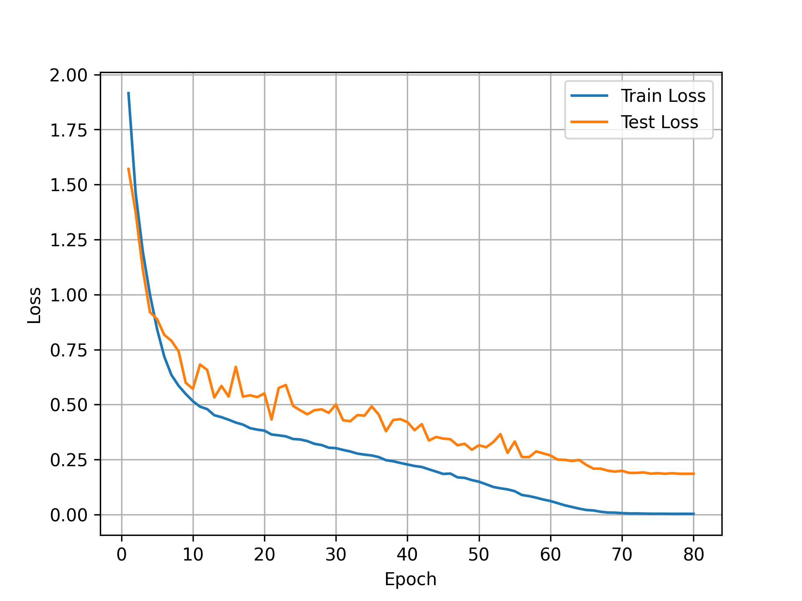
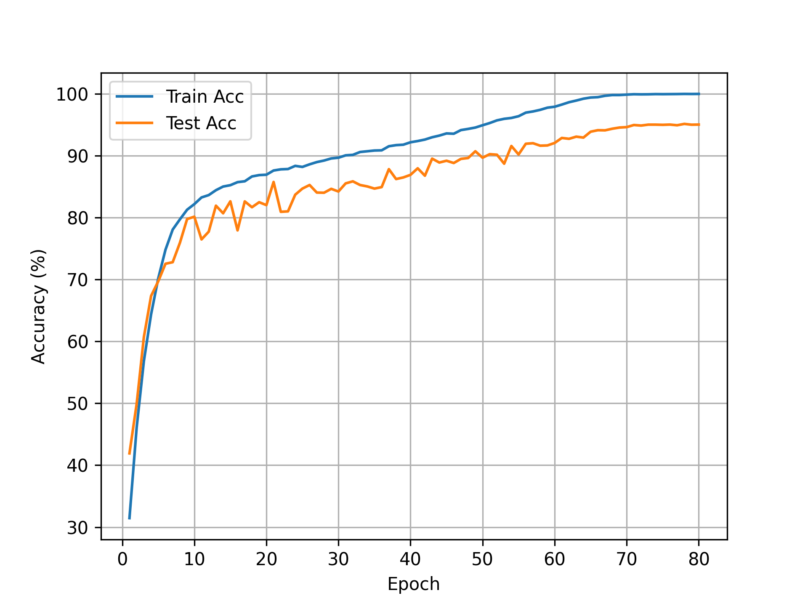

# ResNet18 on CIFAR10 with PyTorch

This project implements ResNet18 from scratch using PyTorch and trains it on the CIFAR10 image classification dataset.

## Project Structure

```text
ResNet18_CIFAR10/
├── model.py
├── train.py
├── test.py
├── predict.py
├── plot_curves.py
├── figures/
├── train.txt
├── .gitignore
└── README.md
```

## Model

The model is a CIFAR10-style ResNet18.

Compared with the original ImageNet ResNet18, this implementation uses:

* 3x3 convolution as the first layer
* stride 1 in the first convolution
* no initial max pooling layer

This is because CIFAR10 images are only 32x32, and aggressive early downsampling may lose too much spatial information.

## Dataset

CIFAR10 contains 10 classes of 32x32 RGB images.

The training pipeline uses:

* RandomCrop with padding
* RandomHorizontalFlip
* ToTensor
* Normalize

## Training

Default settings:

* Batch size: 128
* Optimizer: SGD
* Learning rate: 0.1
* Momentum: 0.9
* Weight decay: 5e-4
* Epochs: 80
* Scheduler: CosineAnnealingLR

## Run

```bash
python train.py
```

The dataset will be downloaded automatically by torchvision if `download=True` is enabled.

## Results

The best checkpoint was obtained at epoch 78.

| Model | Epochs | Best Epoch | Best Test Loss | Best Test Accuracy |
|---|---:|---:|---:|---:|
| ResNet18 | 80 | 78 | 0.1856 | 95.13% |

## Training Curves





## Test

Evaluate the saved checkpoint on the CIFAR10 test set:

```bash
python test.py --model best_model78.pth
```

## Predict

Run inference on a custom image:

```bash
python predict.py --image ./dataset/cat1.jpg --model best_model78.pth
```

The script outputs the top-3 predicted classes and displays the input image with prediction results.

## Notes

Model checkpoints and datasets are not included in this repository.